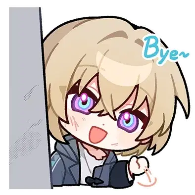
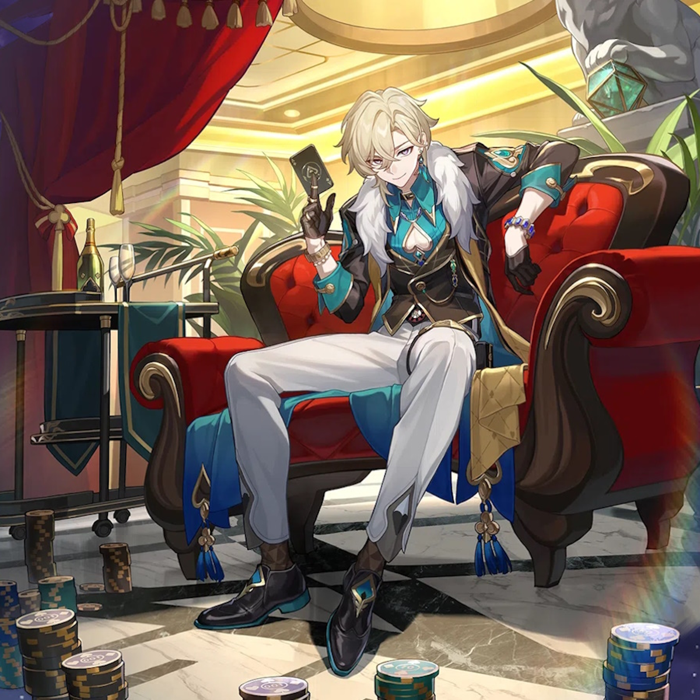
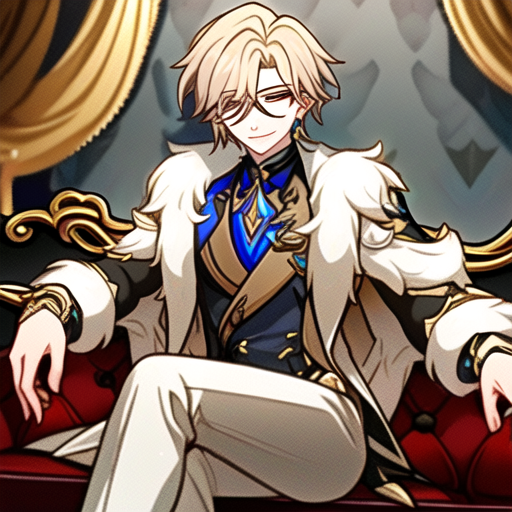
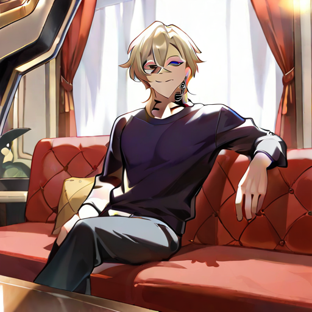
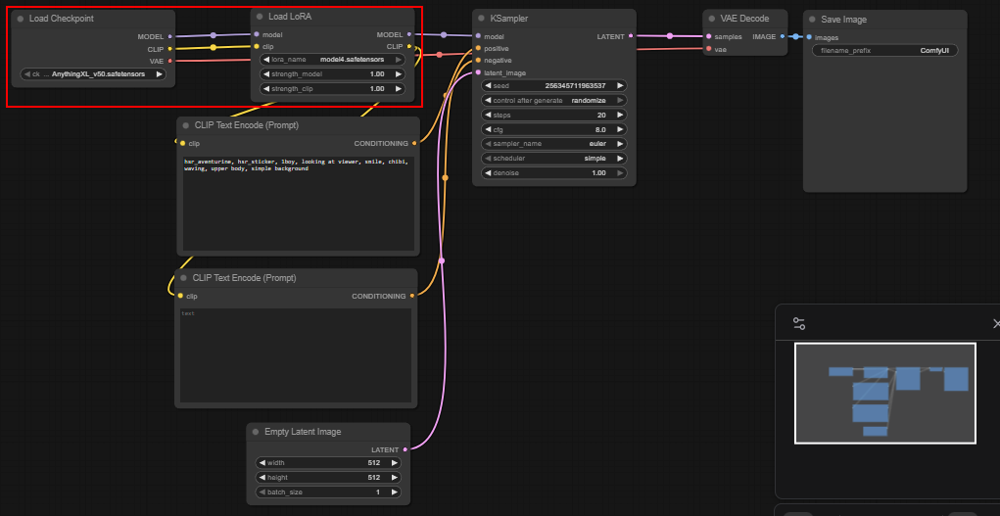
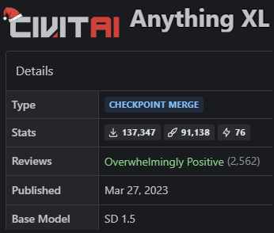
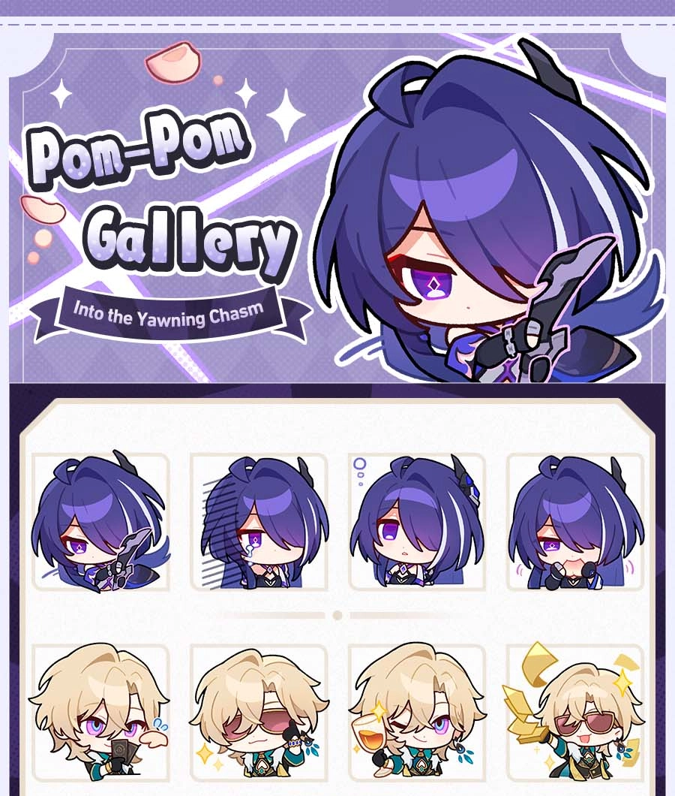
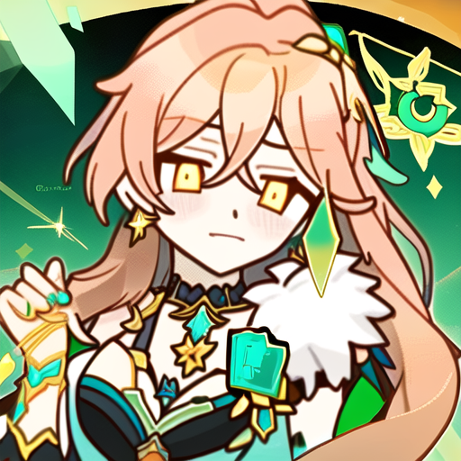
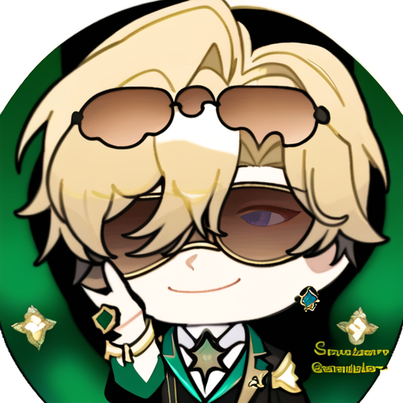
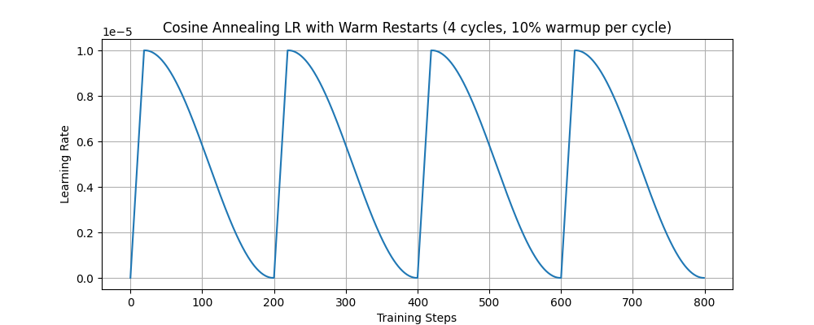

# Anime stickers with Stable Diffusion

A project exploring generation of anime stickers using Stable Diffusion!

## Benchmarked results

Results quality is measured using CLIP similarity, and benchmarked against a [LoRA for the same character on TensorArt](https://tensor.art/en-US/models/891696874837294093/Aventurine-Honkai-Star-Rail-(HSR)-2.0).

Using the benchmark, we can conclude that the quality of our LoRA for anime sticker generation is relatively good.

| Source          | Aventurine sticker | Generated  | Benchmark  |
| :-------------- | :----------------: | :--------: | :--------: |
| Image           |  |  |  |
| CLIP similarity | -                  | 0.7318     | **0.7575** |

| Source          | Aventurine ingame  | Generated  | Benchmark  |
| :-------------- | :----------------: | :--------: | :--------: |
| Image           |  |  |  |
| CLIP similarity | -                  | **0.8171** | 0.7877     |


## Recommended hardware requirements

Nvidia GPU with CUDA support and at least 4GB memory

## Setup

### Install dependencies

Run the following to download Kohya SS and ComfyUI, used for training and inference.

```bash
git clone https://github.com/bmaltais/kohya_ss.git
cd kohya_ss
setup.bat
```

```bash
git clone https://github.com/comfyanonymous/ComfyUI.git
pip install torch torchvision torchaudio --extra-index-url https://download.pytorch.org/whl/cu128 # change according to supported hardware version
cd ComfyUI
pip install -r requirements.txt
```

### Download resources

- Download base model: https://civitai.com/models/9409?modelVersionId=30163
- Download annotated training data: https://drive.google.com/drive/folders/1jGsvbxy96fqlr4VfodseGCNjbOOZ5F5_?usp=sharing

### Suggested folder structure

To keep your files organized during training, you can use this folder structure:

```text
data/   # Training data
    aventurine_dataset/
model/  # Downloaded model checkpoints go here
    AnythingXL_v50.safetensors
output/ # Trained LoRAs and output gets saved to here
log/    # Logging dir for Kohya SS
```

You can put these folders anywhere.

## Training

### Annotation

#### Folder structure

```text
data/
└── 1_dataset_name/
    ├── image.png
    └── image.txt
```

#### Folder naming

You can divide your training images into smaller datasets using folders. Each folder follows the name `<num_repeats>_<dataset_name>` eg `1_gif aventurine`. The idea is to group similar images together so that we can sample each group a similar number of times, per image. This helps ensure equal representation of data when training.

For example, the following folder structure samples images for Acheron, Kafka and Hook in equa proportions:

```text
1_acheron (100 images) -> 100 samples
5_kafka    (20 images) -> 100 samples
50_hook    (2 images)  -> 100 samples
```

#### Tagging

For each image, create a `.txt` file with the same name. You can write comma separated tags in this file for each image. Example:

```text
hsr_aventurine, hsr_sticker, 1boy, looking at viewer, smile, chibi, waving, upper body, simple background
```

#### Auto-annotation

Run the following to get started:

```bash
cd "kohya_ss"
gui.bat
```

From [the UI](http://127.0.0.1:7860/), go to Utilities > Captioning > WD14 Captioning

### Running training

Run the following to get started:

```bash
cd "kohya_ss"
gui.bat
```

1. From [the UI](http://127.0.0.1:7860/), go to LoRA > Training
2. Configuration > Load File and select `config.json`
3. Set the following paths:
    - Pretrained model: model/AnythingXL_v50.safetensors
    - Image folder: data/aventurine_dataset
    - Output directory: output
    - Logging directory: log
4. Scroll to the bottom and Start training!

## Inference

### Folder structure

The following folders in `ComfyUI` are important:

```text
models/
    checkpoints/ # Model checkpoints go here
        AnythingXL_v50.safetensors
    loras/ # Trained LoRAs go here
        hsr_aventurine.safetensors
user/default/workflows/ # Copy the workflow to this folder
    workflow.json
```

### Running inference

Run the following to get started:

```bash
cd ComfyUI
python main.py
```



1. Load workflow `workflow.json`
2. Ensure model checkpoint and LoRAs are loaded
3. Change the positive and negative prompts as you like
4. In the top right, click Run!

## Choice of model and target


| Model | Target | Example tags |
| :---: | :----: | :----------: |
| Anything XL (using SD1.5 as base model) | Anime styled stickers from Honkai Star Rail | Text tags describing target image |
|  |  | <p style="width: 200px">hsr_aventurine, hsr_sticker, 1boy, looking at viewer, smile, chibi, waving, upper body, simple background</p> |

## Challenges faced during training

During initial training, a few flaws were noted. We will discuss what causes these flaws, and how to avoid them, with reference to a training image:

<p style="text-align:center;">

<p style="text-align:center;">Image of Aventurine sticker used in training</p>
</p>

| Observation        | "Aventurine" | HSR "fusion" | Evil clone |
| :----------------- | :----------- | :----------- | :--------- |
| Generated image    |  |  |  |
| Caused by          | Tags clashing with common tags | Universal tags in training data | Small number of training data |
| Why does it happen | <p style="width: 200px">Model already learned weights for tag and has to unlearn them</p> | <p style="width: 200px">Model performs gradient updates more often for these tags, causing them to learn the "average" features</p> | <p style="width: 200px">Memorizing training data</p> |
| Corrective action  | Use customized tags | - Avoid universal tags<br>- Use tag weights | - Increase diversity of training data<br>- Early stopping |

## Final adopted training strategy

### Dataset

The following is the final training data and sampling weights:

```text
data/
└── 1_gif aventurine/
└── 3_gif2 aventurine/
└── 1_gif3 aventurine/
└── 1_gif4 aventurine/
└── 150_images aventurine/
└── 150_stickers aventurine/
```

- To allow the model to generalize to different art styles, both in-game art and stickers are used
- As images from the same GIF are very similar, GIFs are weighted by the inverse of their sequence length to give them the same weight as a single image

### Tags

The following are example tags present in a training image:

<span style="color: blue;">hsr_aventurine, hsr_sticker</span>, <span style="color: purple;">1boy, chibi</span>, <span style="color: orange;">looking at viewer, smile</span>, <span style="color: green;">waving, upper body</span>, <span style="color: red;">simple background</span>

| Tag type                | Example                                                       |
|-------------------------|---------------------------------------------------------------|
| Learned tags            | <span style="color: blue;">hsr_aventurine, hsr_sticker</span> |
| Basic/style descriptors | <span style="color: purple;">1boy, chibi</span>               |
| Face descriptors        | <span style="color: orange;">looking at viewer, smile</span>  |
| Body descriptors        | <span style="color: green;">waving, upper body</span>         |
| Other props present     | <span style="color: red;">simple background</span>            |

The idea is to assign **as few tags as possible** so that all inherent traits of a character are learned and bound to the same tag. For example, when someone mentions a **table**, you naturally assume certain properties without them being explicitly stated:

- A table has four legs
- It has a large, flat surface on top
- It is usually around waist height

These properties are **implied by the concept itself**, not redundantly described every time.

### Training schedule



The LoRA was trained for **8 epochs** using a **cosine annealing with warm restarts** scheduler. Specifically, **4 cycles** of the cosine schedule were applied to gradually vary the learning rate, allowing the network to explore different local minima and avoid premature convergence.

A **low learning rate of $1×10^{-5}$** was chosen to prevent overfitting and ensure that the LoRA adjusts the base model gently, preserving the original model’s learned features while fine-tuning for the target character.

This combination of **multiple epochs, warm restart cycles**, and a **conservative learning rate** strikes a balance between learning the new character features and maintaining model generality.

## Credits

<table>
  <tr>
    <td style="vertical-align: top">
      A special thank you to Haofeng, Hui Qi, and Yong Ann for researching Stable Diffusion and LoRAs with me;
      to Gustinex for the animated stickers; to Phainon on TensorArt for his benchmark model;
      and last but not least, to Hoyolabs for the amazing official in-game and sticker art!
    </td>
    <td style="width: 200px">
      
    </td>
  </tr>
</table>